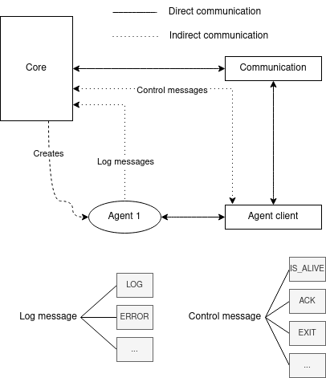

# Program documentation
This program can be used to log GNU/Linux systems.
Processes collecting logs are called agents.
You can create your own agents with C++ library AgentClient.

After start, enabled agents are created and they collect logs. They send these logs to the Core, which saves them in default folder `logs/`. 
This folder and also other properties can be changed in file [SharedSettings.hpp]
Modulog also monitors, if agents are not freezed or they didn't crashed. If this happened, it is logged. 
You can send custom config string to all agents - it can be useful, when you want to have some shared configs between all agents like same timeouts or something like this.
You can set this file in [SharedSettings.hpp] variable `sharedAgentsConfig`. 
To find available Modulog arguments, run `./modulog --help`

## How to use
First, you must select, which agents will be compiled in file [agents-to-compile.json] (set "enabled" to true/false)
You can add also your own agents into this file, they will be compiled automatically with whole program, if they are enabled.

You can configure agents with their config files - settings like how often take log, which values are considered as error etc.
These settings should be in each agent folder named [config.json] (this file is copied with each build into build directory, so if you would like to change some values, you can change it in agent source
folder and then recompile whole program or change config file in agent build folder)

Then compile all with:

`mkdir build && cd build`

`cmake -DBRINGAUTO_BUILD_DEP=ON -DCMAKE_BUILD_TYPE=Release .. && make -j 8`

In build folder is now created file `agents-enabled.conf` - here, you can enable/disable agents, that will be used during runtime (simply delete line or comment with `#` character).
All agents in this file must be already compiled!

Now you can run with `./modulog`.

To run tests, compile and run like this:
`cmake -DBRINGAUTO_TESTS=ON -DCMLIB_DIR=/home/martin/Work/cmakelib -DCMAKE_BUILD_TYPE=Release .. && make -j 8 && ctest --verbose`

**CMake options:**

BRINGAUTO_BUILD_DEP - 
if ON, then all dependencies are downloaded and compiled. 

BRINGAUTO_SYSTEM_DEP - not yet 100% working.
if ON, then using already installed dependencies. 
If OFF, then is used [cmakelib] for dependency management - you have to alse specify path to [cmakelib] through switch -DCMLIB_DIR=/path/to/cmlib .

BRINGAUTO_INSTALL - if ON, then create install target (after `make`, you can type `make install`, which will install binaries to `CMAKE_INSTALL_PREFIX` folder)
 
BRINGAUTO_PACKAGE - if ON, target for creating package is generated (after `make`, you should type `make install && make package`)

BRINGAUTO_TESTS - if ON, then test target is generated.
You can run them after `make` with `ctest --verbose`.
Before testing, make sure, that you have got same values in [SharedSettings.hpp] as in github branch, where you pulled it from!
(tests will not pass, if there will be different timeouts)

## Dependencies
Look at the [Dependencies.cmake].
Agents have their dependencies inside their folder.

# Create own agent
You can look in [agents folder link] to find out, how to create agents.
In CMake, just link it against `agent_client_lib`, then in code initialize client and start sending logs.
Agent folder must have the same name as the executable inside.
You can enable client debug mode when creating agent - just set AGENT_CLIENT_STANDALONE macro by passing -DAGENT_CLIENT_STANDALONE=ON to agent CMake.
With this, you can use agent standalone without core (client will just print to output, what would be sent).

When is agent ready to use, you can add path to directory to the file [agents-to-compile.json]. 
**In this directory must be executable with same name as the directory name.**
When you have got same CMake structure as built-in agents, main CMake will take care of compiling everything and agent should be built automatically.

# How it works
This is, how architecture of modulog looks like: 

And also flowchart diagram:

# Cross-compiling
* when program throws error "GLIBCXX_3.4.26 not found" you have to update libstdc++6

## Raspberry Pi 4
* install arm-linux-gnueabihf (version 9.3.0 working on RPI OS Bullseye having GCC 10.2.1)
* copy /lib, /opt, /usr folders from Rpi to local folder (in our case called "rootfs")
* through cmd or in file `rpi-toolchain-file.cmake` specify path to this folder (variable `CMAKE_FIND_ROOT_PATH` and `CMAKE_SYS_ROOT`)
* now you can build:
   * `mkdir build`
   * `cd build`
   * `cmake -DCMAKE_TOOLCHAIN_FILE=../toolchains/raspberry_toolchain.cmake -DCMAKE_SYSROOT=/path/to/sysroot -DBRINGAUTO_INSTALL=ON -DCMAKE_INSTALL_PREFIX="someDir" ..`
   * `make -j 8 install`
   * output in `someDir` can be moved to RPI

## aarch64 architecture
* install `gcc-aarch64-linux-gnu` (tested version 9.3.0)
* rest same as above, just modify cmake variable `-DCMAKE_TOOLCHAIN_FILE=../toolchains/aarch_toolchain.cmake`

---

## Pitfalls we will work on + TODO
1. Not the most effective - like sending logs in json etc.
2. Not rotating log files when folder structure (when switch --one-file, then it's ok)

TODO:
1. Create agent template for better agent creation - when this done, split big agents into smaller parts
2. Remove Core global variable and make it local 
3. Agent client - sleep template (different units like seconds, minutes, etc.)
4. Watchdog agent - not specified, what should do, when device not responding (maybe restart it or something like it?) + reset flags after
5. Do better dependency management - not fully supported switching between system deps / cmakelib
6. Better SharedSettings - change to json or something, that can be changed without re-compilation

[agents folder link]: agents
[agents-to-compile.json]: agents-to-compile.json
[Dependencies.cmake]: cmake/Dependencies.cmake
[agents-to-compile.json]: agents-to-compile.json
[config.json]: agents/uptime-agent/config.json
[SharedSettings.hpp]: meta-lib/include/modulog/meta_lib/SharedSettings.hpp
[cmakelib]: https://github.com/cmakelib/cmakelib

